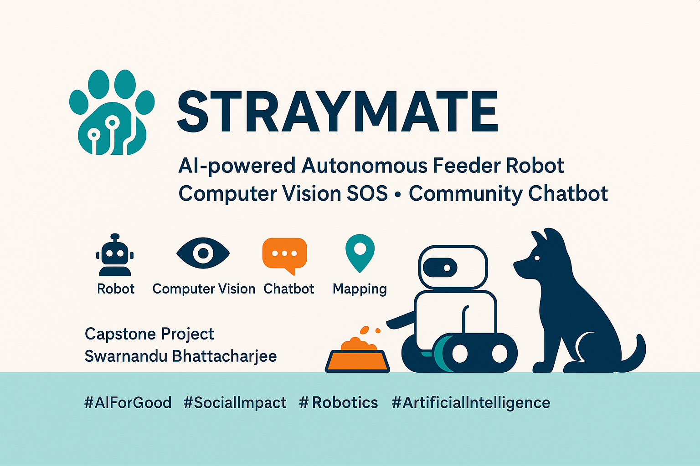
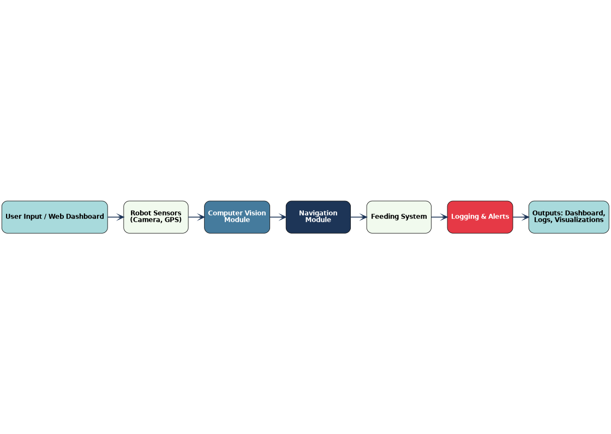

=======
# StrayMate-AI-Bot 🤖🐾

**Author:** Swarnendu Bhattacharjee  
**Email:** swarnendu1213@gmail.com  

---

## Overview
**StrayMate-AI-Bot** is an AI-powered autonomous system designed to care for stray animals.  
It integrates:
- **NLP Chatbot:** Interactive guidance & data collection  
- **Computer Vision:** Injury detection & animal recognition  
- **Data Science:** Mapping & scheduled feeding operations  
- **Automation:** Multi-point food & water dispensing  

This system is designed for real-time monitoring, emergency SOS alerts, and intelligent feeding schedules.

 (assets/straymate_technical_overview.png)

---

## Key Features
1. **Intelligent Chatbot (NLP):** Provides interactive information about the bot and collects animal-related data from users.  
2. **Animal Detection & SOS Alerts (CV):** Identifies injured animals in real-time and sends automated alerts to civic authorities.  
3. **Mapping & Analytics (Data Science):** Generates locality maps for feeding zones and monitors patterns for optimization.  
4. **Automated Feeding System:** Timed multi-point dispensing of food and water based on mapped schedules.  
5. **Integrated Monitoring Dashboard:** Optional web interface to track activity, feeding logs, and SOS notifications.

---
## 🏗 Architecture



The system flow includes:

1. **User Input / Dashboard** → 2. **Robot Sensors (Camera, GPS)** → 3. **Computer Vision Module** → 4. **Navigation Module** → 5. **Feeding System** → 6. **Logging & Alerts** → 7. **Outputs: Dashboard, Logs, Visualizations**


---


## 🛠 Technology Stack

| Component | Technology / Library |
|-----------|-------------------|
| Backend   | Python, Flask, FastAPI |
| AI & CV   | OpenCV, TensorFlow / PyTorch |
| Robotics  | Raspberry Pi, Arduino, Motors, Sensors |
| Database  | SQLite / MySQL |
| Dashboard | HTML, CSS, JavaScript, Plotly / Dash |
| Deployment | Docker, GitHub Actions |

---

## 📂 Repository Structure

```text
stray-animal-feeder/
├── api/                    # Api python code
├── assets/                 # Images, architecture diagrams, icons
├── docs/                   # Project documentation
├── notebooks/              # Jupyter notebooks for experiments
├── scripts/                # Utility scripts
├── src/                    # Core source code
├── .gitattributes          # Configuration files
├── .gitignore              # Configuration files
├── compose                 # Compose yaml file
├── config                  # Configuration yaml file
├── requirements.txt        # Python dependencies
├── README.md               # Project overview
└── LICENSE                 # License information
